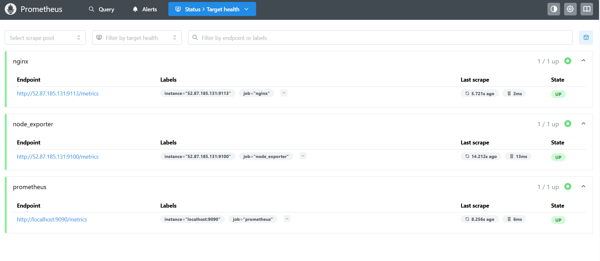
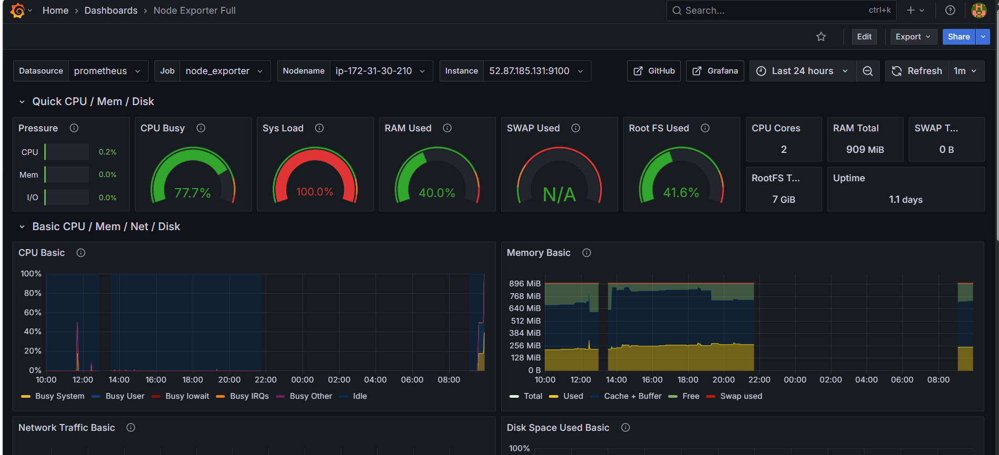
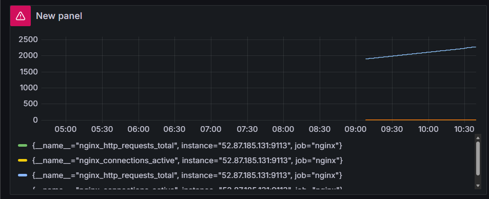
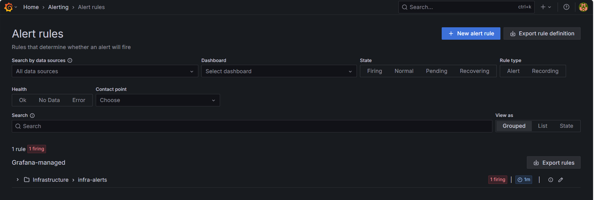

# AWS Observability Monitoring Project

## Overview

Built an end-to-end monitoring and observability stack on AWS using Prometheus, Grafana, Node Exporter and Nginx Exporter.

## Architecture

### Monitoring Server

* Prometheus
* Grafana

### Application Server

* Nginx
* Node Exporter
* Nginx Exporter

## Tech Stack

* AWS EC2
* Ubuntu
* Prometheus
* Grafana
* Node Exporter
* Nginx Exporter
* Nginx

## Metrics Monitored

* CPU Usage
* Memory Usage
* Disk Usage
* Network Usage
* Nginx Requests
* Active Connections

## Setup Steps

### 1. Launch Two EC2 Instances

* Monitoring Server
* Application Server

### 2. Install Nginx

Nginx was installed on the application server.

### 3. Install Node Exporter

Node Exporter exposes Linux metrics on port 9100.

### 4. Install Nginx Exporter

Nginx Exporter exposes Nginx metrics on port 9113.

### 5. Configure Prometheus

Prometheus scrapes metrics from:

* Prometheus
* Node Exporter
* Nginx Exporter

### 6. Install Grafana

Grafana was connected with Prometheus as a data source.

### 7. Create Dashboards

Created dashboards for:

* CPU Usage
* Memory Usage
* Disk Usage
* Network Usage
* Nginx Requests
* Active Connections

### 8. Configure Alerts

Configured alerts for:

* High CPU Usage
* Nginx Availability

## Configuration Files

* configs/prometheus.yml
* configs/nginx.conf

## Screenshots

### Prometheus Targets

### Grafana Dashboard

### Nginx Dashboard

### CPU Alert

## Learning Outcomes

* Monitoring
* Observability
* PromQL
* Grafana Dashboards
* Alerting
* Troubleshooting

## Author

Amoghshanker Goswami
